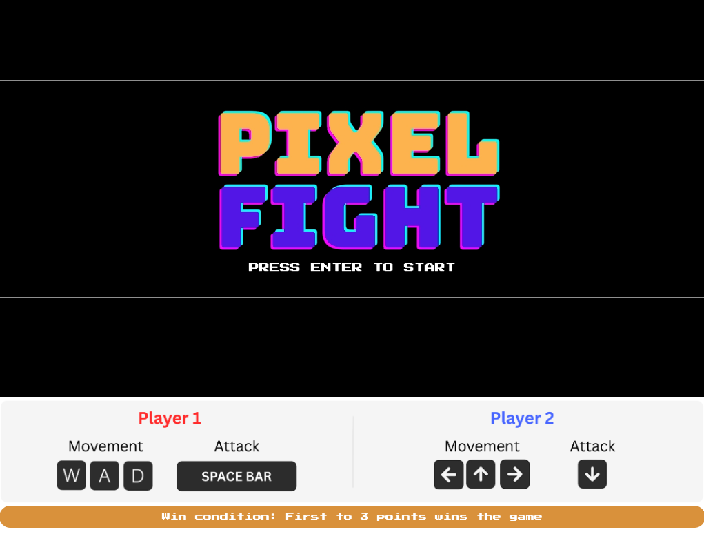
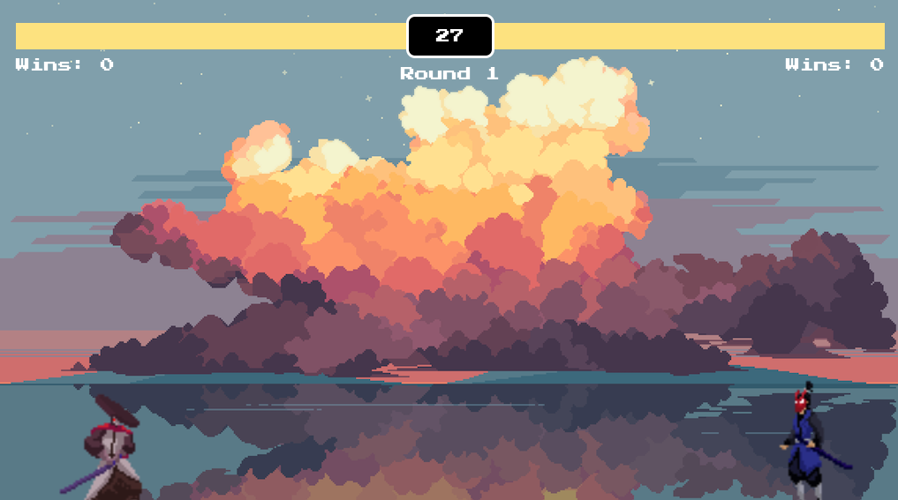
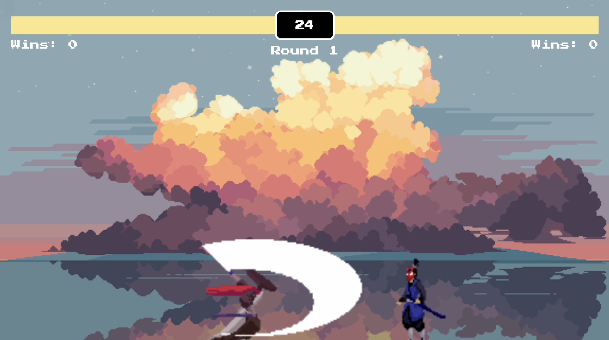
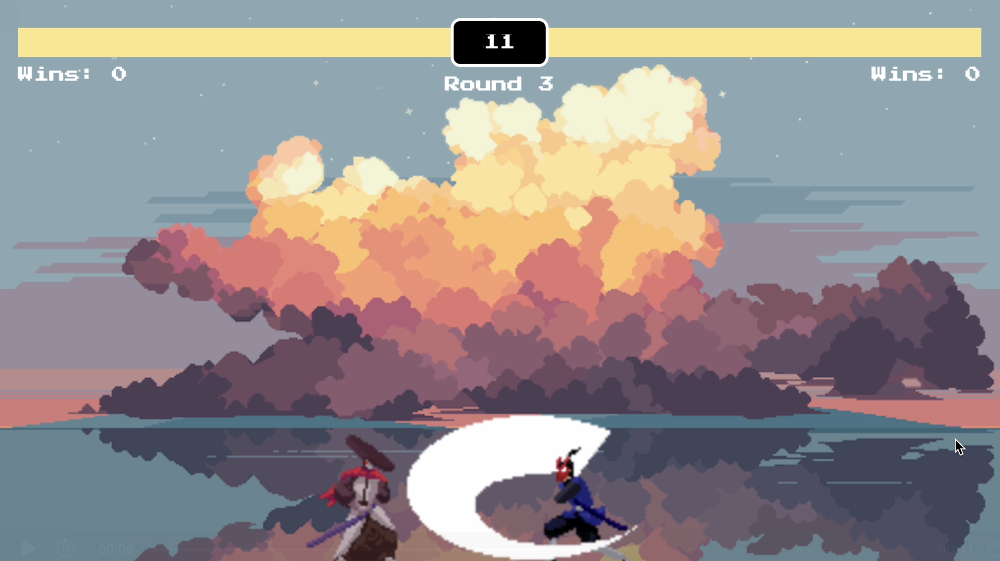

# pixel-fight
<strong>Welcome to Pixel Fight!</strong> 
Play it here: https://sheena-yeong.github.io/pixel-fight/

# About the Game
This is a 1v1 game where 2 players will strike each other with mid-ranged katanas to secure a win within 30 seconds. The game ends when a player secures 3 wins (ties are not wins). 

Growing up, I loved playing mini browser games on Miniclip and Y8. My favorite were the ones where a friend and I would huddle around a keyboard, each using different keys to control our characters on the same screen. The competition made every match exciting, and it’s exactly why I chose to create a game in that same style.

# Players
<strong>Player 1</strong> uses the controls "W, A, D" to move around and "Space" to attack. He has a longer katana range, but slower attack speed with higher damage per hit.

<strong>Player 2</strong> uses the controls "←, →, ↑" to move around and "↓" to attack. He has a shorter katana range, with higher attack speed and lower damage per hit.

<strong>Technologies used:</strong> HTML, CSS, JavaScript

<strong>Stretch Goals:</strong>
- Implement a meter charge that goes up when players successfully lands a hit to gain a chance to land a more powerful attack when the meter is full
- Implement long ranged projectiles
- Allow players to face the other direction when crossing each other

<strong>Attributions:</strong>
- Game background: https://free-game-assets.itch.io/ocean-and-clouds-free-pixel-art-backgrounds?download
- Player 1 Sprites: https://luizmelo.itch.io/martial-hero?download
- Player 2 Sprites: https://luizmelo.itch.io/martial-hero-2?download
- Google Font (Press Start): https://fonts.google.com/specimen/Press+Start+2P
- Game Set Up Tutorial: https://www.youtube.com/watch?v=vyqbNFMDRGQ&t=11202s
